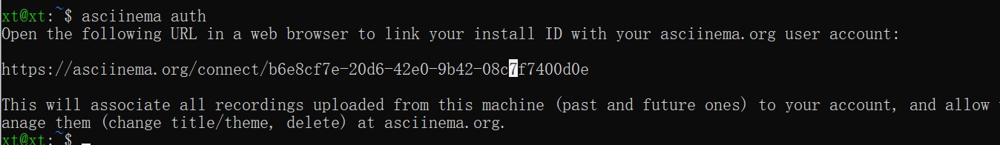

# 实验二


## 一、实验目的

熟悉掌握vimtutor基本用法，练习英文阅读文本。

学会用asciinema录制视频。

## 二、实验环境

ubuntu 20.04、asciinema

## 三、实验过程

### 1、在asciinema注册一个账号，并在本地安装配置好asciinema

```cmd
sudo apt-add-repository ppa:zanchey/asciinema
sudo apt-get update
sudo apt-get install asciinema
```

### 2、本地已经完成asciinema auth，并在asciinema关联本地账号和在线账号



生成保存上传视频的地址:

https://asciinema.org/connect/b6e8cf7e-20d6-42e0-9b42-08c7f7400d0e

输入asciinema rec就可以开始录制,输入exit就可以终止录制

### 3、开始阅读vimtutor文档并练习相关操作

lesson1.1-1.4

[](https://asciinema.org/a/mmAVzoWP4lzfPmRJ5sys0RsMN)

lesson1.5-2.1

[](https://asciinema.org/a/S9QlbcOu8J1f7OF0yLTkpq8B5)

lesson2.2-2.6

[](https://asciinema.org/a/njTLvsf9YXZRZEfgIon9PsnXM)

lesson2.7-3.3

[](https://asciinema.org/a/7ZtO0mIc6sarp3ptW573afFG2)

lesson3.4-4.3

[](https://asciinema.org/a/3P91ZuGYbmqucQHtZvSZOOaTT)

lesson4.4-5.3

[](https://asciinema.org/a/2mBgjWe4F5hHEkQ5VjcMSk5oI)

lesson5.4-6.3

[](https://asciinema.org/a/nEoWScVzmSDgOQsV2iJ7Tl89Y)

lesson6.4-end

[](https://asciinema.org/a/DqRfNX6tioOxd3hRzfwOMEvYh)


### 4、vim自查清单

- 你了解vim有哪几种工作模式？

  答：1、命令模式 2、插入模式 3、底行模式


- Normal模式下，从当前行开始，一次向下移动光标10行的操作方法？如何快速移动到文件开始行和结束行？如何快速跳转到文件中的第N行？

  答：

  一次向下移动光标十行：10j

  移动到文件开始行：gg

  移动到文件结束行：G

  快速跳转到文件中第N行： ：N

  

- Normal模式下，如何删除单个字符、单个单词、从当前光标位置一直删除到行尾、单行、当前行开始向下数N行？

  答：

  删除单个字符：移动光标到要删除字符上，按下x键以删除光标所在的字符。

  删除单个单词：移动光标到需要删除的单词头，键入dw以使该单词消失。

  从当前光标一直删除到行尾：键入d$以删除到行尾。

  删除单行：键入dd以删除行

  删除当前行向下数N行：键入Ndd以删除后N行

  

- 如何在vim中快速插入N个空行？如何在vim中快速输入80个-？

  答：

  快速插入N个空行：键入No在后面插入N个空行，键入NO在前面插入N个空行。

  快速输入80个-：键入80i-，然后esc。

  

  

  

- 如何撤销最近一次编辑操作？如何重做最近一次被撤销的操作？

  答：

  撤销最近一次编辑操作:键入u以恢复最后执行的命令

  重做最近一次被撤销的操作：CTRL+R

  

- vim中如何实现剪切粘贴单个字符？单个单词？单行？如何实现相似的复制粘贴操作呢？

  答：

  剪切粘贴单个字符：输入x键以删除光标所在的字符，移动光标到被删字符要到达的前一个字符，键入p将那个字符粘贴到光标后。

  

  剪切粘贴单个单词：输入dw键以删除光标所在的字符，移动光标到被删单词要到达的前一个单词，键入p将那个单词粘贴到后面。

  

  剪切粘贴单行：输入dd以删除该行，该行会被存储至VIM寄存器中。移动光标到被删除行要到达的前行，键入p将那行粘贴到光标之下。

  

  实现相似的复制粘贴操作：输入y复制，输入p粘贴。

  

- 为了编辑一段文本你能想到哪几种操作方式（按键序列）？

  答：

  1、删除字符：移动光标到要删除字符上，按下x键以删除光标所在的字符。

  2、插入字符：移动光标到要插入文本处字符上，按下i键以插入需要的字符。

   3、追加文本：按下A键然后键入要添加的内容，当添加完文本后按下，返回到正常模式。

  4、删除单词：移动光标到需要删除的单词头，键入dw以使该单词消失。5、删除行：移动光标到正确行的末端，键入d$以删除到行尾。

  6、删除单行：键入dd以删除行。

  7、复制粘贴文本：输入y复制，输入p粘贴。

  8、退出文本编辑时，使用：q！不保存对文本的修改，或者使用：wq保存对文本的修改。

  

- 查看当前正在编辑的文件名的方法？查看当前光标所在行的行号的方法？

  答：

  按住CTRL键，并输入g（即称之为CTRL-G），在页面底部会呈现一个信息，指出文件名和当前文件位置。

  

- 在文件中进行关键词搜索你会哪些方法？如何设置忽略大小写的情况下进行匹配搜索？如何将匹配的搜索结果进行高亮显示？如何对匹配到的关键词进行批量替换？

  答：

  关键词搜索：在正常模式，输入/字母，输入想要搜索的单词。想要再次搜索相同的短语，简单的键入n。想要再次搜索相同的短语并以相反的反向，键入N。要反向搜索一个短语，使用？替换/。要返回之前的位置，输入CTRL-O，重复几次回到更早的时刻，CTRL-I回到以后位置。

  

  设置忽略大小写情况进行匹配搜索：在vim中将搜索设置为不区分大小写输入：set ic。

  

  将匹配的搜索结果进行高亮显示：输入：set hlsearch。

  

  对匹配到的关键词进行批量替换：

  键入s/old/new用new替换old。（此命令仅会更改本行的第一例old）。

  键入s/old/new/g（加入的g意味着会替换本行所有的old）。

  键入#，#s/old/new/g（更改两行间所有的匹配字符串，其中#，#是更改的行号范围）。

  键入%s/old/new/g（更改全文件中的所有事件，并给出替换与否的提示）。

  

- 在文件中最近编辑过的位置来回快速跳转的方法？

  答：上一个位置CTRL-O，下一个位置CTRL-I。

- 如何把光标定位到各种括号的匹配项？例如：找到(, [, or {对应匹配的),], or }

  答：将光标移动到匹配的括号上，按%以移动光标到其他的匹配括号。

  

- 在不退出vim的情况下执行一个外部程序的方法？

  答:键入!字符，允许执行一个任何外部的shell命令。（例如键入！ls，然后敲击，这就会显示一个目录）

  

- 如何使用vim的内置帮助系统来查询一个内置默认快捷键的使用方法？如何在两个不同的分屏窗口中移动光标？

  答：

  输入help打开帮助窗口，输入help cmd以找出关于cmd的帮助。

  输入CTRL-W以跳转到另一窗口。


