# 实验四：shell脚本编程基础

## 一、实验目的

熟悉shell脚本的基础编程

## 二、实验环境

Ubuntu20.04，vscode，imagemagick

## 三、任务

1、任务一：用bash编写一个图片批处理脚本，实现以下功能：

- （√）支持命令行参数方式使用不同功能
- （√）支持对指定目录下所有支持格式的图片文件进行批处理
- （√）支持以下常见图片批处理功能的单独使用或组合使用
  - （√）支持对jpeg格式图片进行图片质量压缩
  - （√）支持对jpeg/png/svg格式图片在保持原始宽高比的前提下压缩分辨率
  - （√）支持对图片批量添加自定义文本水印
  - （√）支持批量重命名（统一添加文件名前缀或后缀，不影响原始文件扩展名）
  - （√）支持将png/svg图片统一转换为jpg格式图片


2、任务二：用bash编写一个文本批处理脚本，对以下附件分别进行批量处理完成相应的数据统计任务：

- 2014世界杯运动员数据
  - （√）统计不同年龄区间范围（20岁以下、[20-30]、30岁以上）的球员**数量**、**百分比**
  - （√）统计不同场上位置的球员**数量**、**百分比**
  - （√）名字最长的球员是谁？名字最短的球员是谁？
  - （√）年龄最大的球员是谁？年龄最小的球员是谁？


任务三：用bash编写一个文本批处理脚本，对以下附件分别进行批量处理完成相应的数据统计任务：

- Web服务器访问日志
  - （√）统计访问来源主机TOP 100和分别对应出现的总次数
  - （√）统计访问来源主机TOP 100 IP和分别对应出现的总次数
  - （√）统计最频繁被访问的URL TOP 100
  - （√）统计不同响应状态码的出现次数和对应百分比
  - （√）分别统计不同4XX状态码对应的TOP 10 URL和对应出现的总次数
  - （√）给定URL输出TOP 100访问来源主机

## 四、实验过程

### 环境准备：

```
sudo apt-get update && sudo apt install shellcheck
```

```
sudo apt-get install imagemagick
```

```
 wget "https://c4pr1c3.github.io/LinuxSysAdmin/exp/chap0x04/worldcupplayerinfo.tsv"
```

```
wget "https://c4pr1c3.github.io/LinuxSysAdmin/exp/chap0x04/web_log.tsv.7z"
```

```
sudo apt-get install p7zip-full
```

```
sudo apt-get install ghostscript
```

### 任务一：

1、打开help文档

```
bash chap0x04-1.sh -h
```

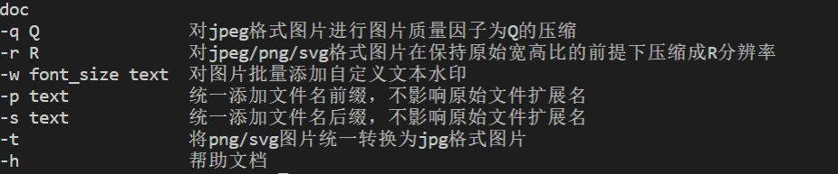

2、对jpeg格式图片进行图片质量压缩

```
bash chap0x04-1.sh -q 30
```

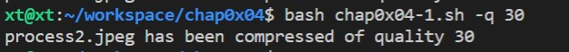

3、支持对jpeg/png/svg格式图片在保持原始宽高比的前提下压缩分辨率

```
bash chap0x04-1.sh -r 50
```

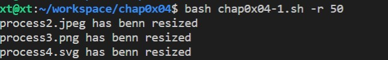

4、对图片批量添加自定义文本水印

```
bash chap0x04-1.sh -w 50 "text 10,10 'Works like magick' "
```

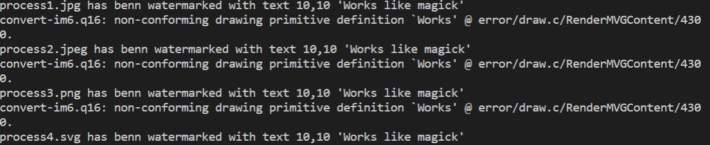

5、批量重命名（统一添加文件名前缀或后缀，不影响原始文件扩展名）

```
bash chap0x04-1.sh -p chap0x04
```

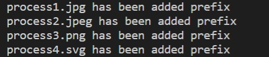

```
bash chap0x04-1.sh -s 0
```

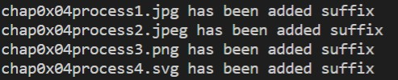

6、将png/svg图片统一转换为jpg格式图片

```
bash chap0x04-1.sh -t
```

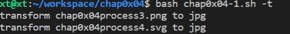

### 任务二：

1、打印help文档：

```
bash chap0x04-2.sh -h
```

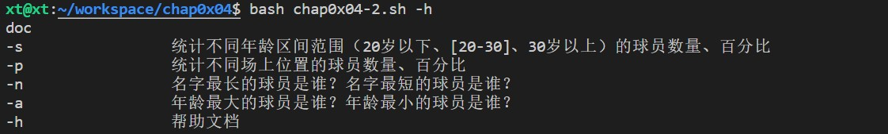

2、统计不同年龄区间范围（20岁以下、[20-30]、30岁以上）的球员数量、百分比

```
bash chap0x04-2.sh -s
```

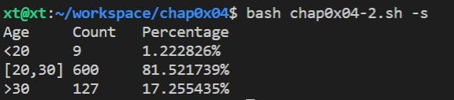

3、统计不同场上位置的球员数量、百分比

```
bash chap0x04-2.sh -p
```

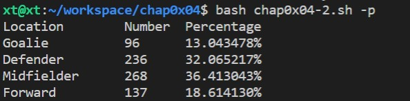

4、名字最长的球员是谁？名字最短的球员是谁？

```
bash chap0x04-2.sh -n
```

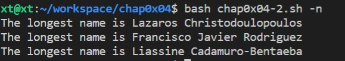

5、年龄最大的球员是谁？年龄最小的球员是谁？

```
bash chap0x04-2.sh -a
```

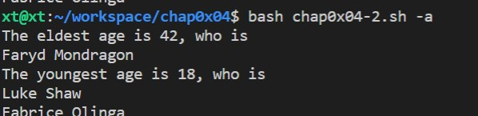

### 任务三：

1、打开help文档

```
bash chap0x04-3.sh -h
```

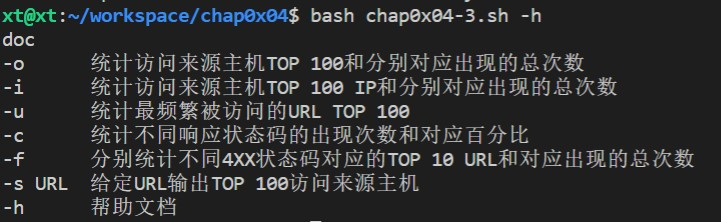

2、统计访问来源主机TOP 100和分别对应出现的总次数

```
bash chap0x04-3.sh -o
```

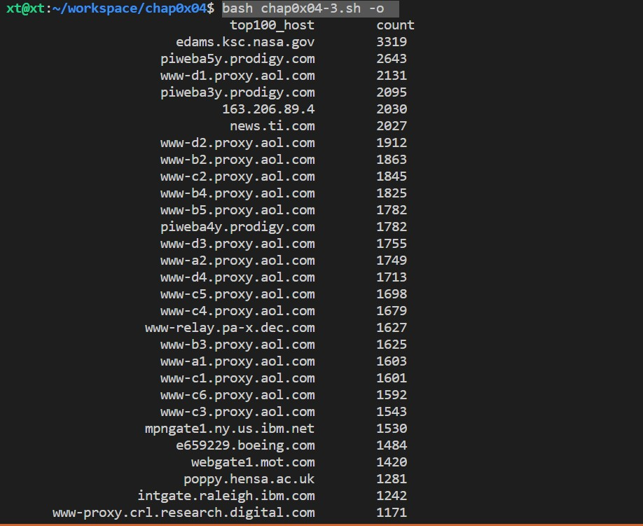

3、统计访问来源主机TOP 100 IP和分别对应出现的总次数

```
bash chap0x04-3.sh -i
```

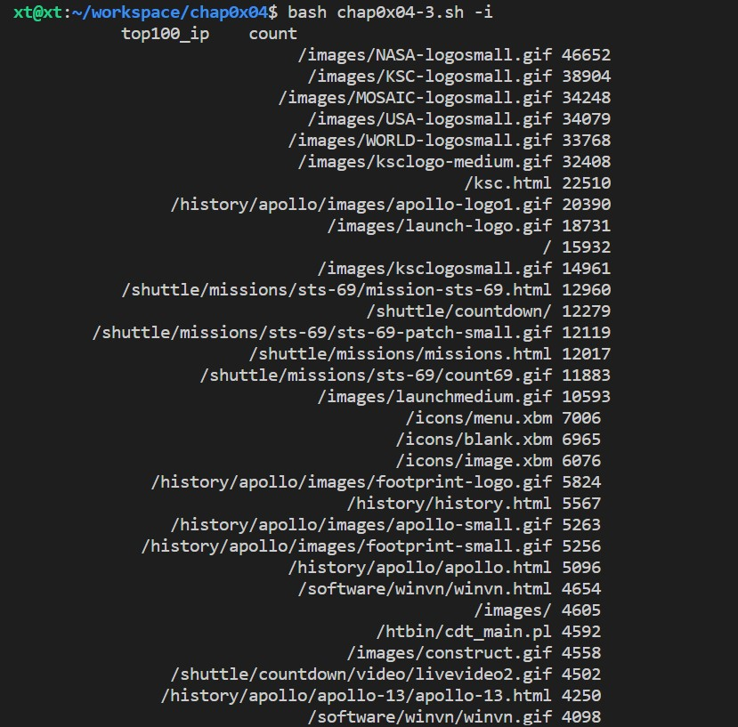

4、统计最频繁被访问的URL TOP 100

```
bash chap0x04-3.sh -u
```

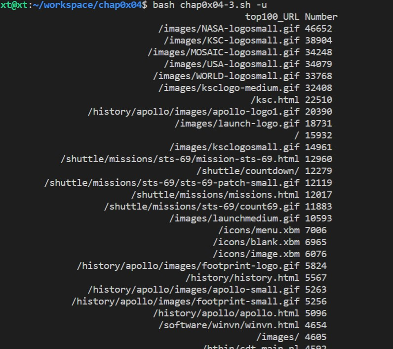

5、统计不同响应状态码的出现次数和对应百分比

```
bash chap0x04-3.sh -c
```

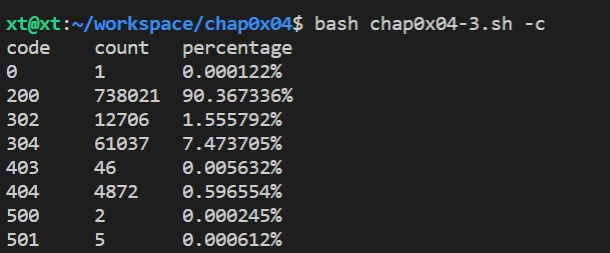

6、分别统计不同4XX状态码对应的TOP 10 URL和对应出现的总次数

```
bash chap0x04-3.sh -f
```

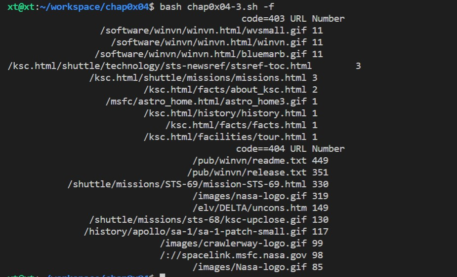

7、 给定URL输出TOP 100访问来源主机

```
bash chap0x04-3.sh -s
```

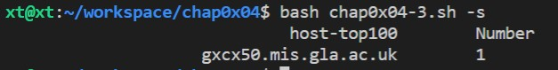

## 五、问题及解决方法

在git CLI基本操作时出现

1、editor环境变量指向vim的配置

```
echo 'export EDITOR=vim' >> ~/.bashrc && source ~/.bashrc
```

2、报unable to auto-detect email address 错误

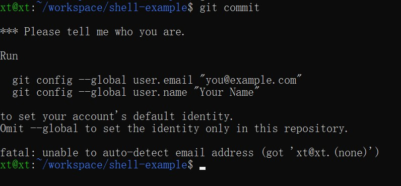

找到.git文件
进入config
加上
［user］
 email＝your email
 name＝your name
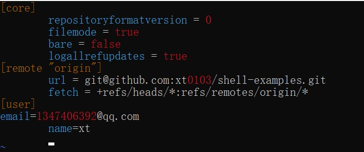

3、git push origin master 报错

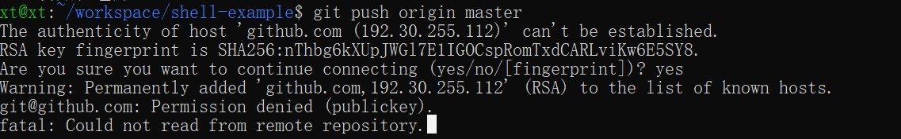

解决办法：

生成公钥

```
ssh-keygen -t rsa -C"1347406392@qq.com"
```

找到公钥

```
cat ~/.ssh/id_rsa.pub
```

在git上添加公钥


4、sudo apt update失败


通过以下解决：

```
 sudo add-apt-repository -r ppa:zanchey/asciinema
```

## 六、参考资料


1、imagemagick使用指南

[https://blog.csdn.net/wangmeitingaa/article/details/88885711](https://blog.csdn.net/wangmeitingaa/article/details/88885711)

2、黄大视频

https://www.bilibili.com/video/BV1Hb4y1R7FE?[](https://www.bilibili.com/video/BV1Hb4y1R7FE?)

3、哥姐的参考

[https://github.com/CUCCS/linux-2020-LyuLumos/pull/6/commits/e4fd988f578222ab80af331641934d76a363ab31](https://github.com/CUCCS/linux-2020-LyuLumos/pull/6/commits/e4fd988f578222ab80af331641934d76a363ab31)

4、awk使用参考

[https://blog.csdn.net/wyqwilliam/article/details/83896277](https://blog.csdn.net/wyqwilliam/article/details/83896277)

